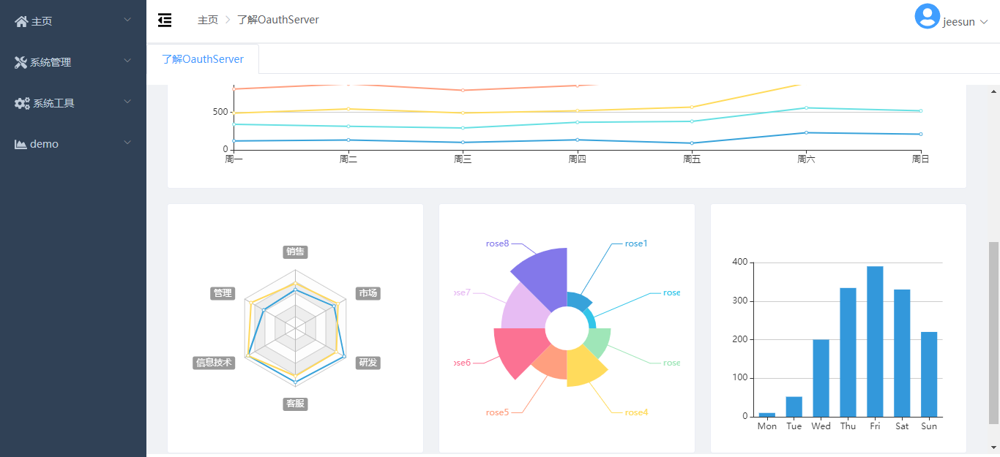

# oauthserver

国内用户可访问[gitee](https://gitee.com/jeesun/oauthserver)，代码和[github](https://github.com/jeesun/oauthserver)同步。

## 简介
oauthserver是一个基于Spring Boot Oauth2的完整的独立的Oauth2 Server微服务。项目的目的是，仅仅需要创建相关数据表，修改数据库的连接信息，你就可以得到一个Oauth2 Server微服务。  
为了开发方便，项目拆分成三个模块，api、web和common：
1. api运行在8181端口，api模块是提供api服务的，主要是oauth token等其他业务接口；
2. web运行在8182端口，是一个基于Element UI的管理后台；
3. common是公共工具模块。

支持的关系型数据库：
- MySQL
- Oracle
- PostgreSQL
- Microsoft SQL Server

## 功能概览
### api
1. Oauth token服务，支持3种登录方式：手机号+验证码、手机号+密码、邮箱+密码（使用流程参考[oauth接口调用示例](tutorial/api.md)，如果你需要使用短信验证码服务，请前往阿里大于和云之讯短信服务购买短信验证码服务，并在application.properties中配置相关参数）；
2. 短信验证码服务，支持三种：阿里大于、腾讯云短信服务、云之讯短信服务；
3. 微信、支付宝支付；
4. 七牛云存储；
5. 代码生成器。
### common
公共工具类模块
### web
1. 主页
   1. 了解OauthServer
   2. 新闻管理
   3. 订单管理
2. 系统管理
   1. 定时任务
   2. 菜单管理
   3. 用户管理
   4. 权限管理
   5. 数据字典
3. 系统工具
   1. 代码生成
   2. swagger
   3. druid
   4. 日志管理

## 更新日志
### 2.0.20190805-alpha
1. 支持SQL Server。

### 2.0.20190802-alpha
1. 代码生成器支持sql server；
2. service通用实现，减少大量冗余serviceImpl代码。

### 2.0.20190708-alpha
1. 代码生成器多语言bug修复；
2. postgresql环境下的sql bug修复；
3. 更新全局异常处理；
4. session有效期为半小时，解决登录失效时，跳转登录页面的iframe嵌套问题；
5. 升级element-ui 2.9.1->2.10.1；
6. 添加验证码测试接口；
7. 减少一些依赖；
8. 给t_users表的username列添加唯一键；
9. 修复使用refresh_token刷新access_token时，报“不支持的登录方式”的bug；
10. web模块支持用户名登录；
11. api模块新增常用用户相关接口。

**更多历史更新日志查看[CHANGE_LOG.md](tutorial/CHANGE_LOG.md)**

## 使用流程
### 准备
IntelliJ IDEA或Eclipse请先安装lombok插件。
- IntelliJ IDEA安装请参考[https://projectlombok.org/setup/intellij](https://projectlombok.org/setup/intellij)；
- Eclipse安装请参考[https://projectlombok.org/setup/eclipse](https://projectlombok.org/setup/eclipse)。
### 1. 安装jar
有部分自建jar在中央仓库是没有的，需要使用`mvn install`安装到本地。执行“需要安装的jars”文件夹下的`install.bat`安装。
### 2. 建表
- MySQL  
请执行`schema-mysql.sql`，完成数据表的创建和测试数据的导入。之后，请执行SQL增量更新目录下的增量更新SQL。
- Oracle  
请执行`schema-oracle.sql`，完成数据表的创建和测试数据的导入。之后，请执行SQL增量更新目录下的增量更新SQL。
- PostgreSQL  
请执行`schema-postgresql.sql`，完成数据表的创建和测试数据的导入。之后，请执行SQL增量更新目录下的增量更新SQL。
- SQL Server  
请执行`schema-sqlserver.sql`，完成数据表的创建和测试数据的导入。之后，请执行SQL增量更新目录下的增量更新SQL。
### 3. 修改数据库连接信息
- MySQL  
连接信息在`application-mysql.yml`里。修改完数据库连接信息后，还需要设置`application-common.yml`的`spring.profiles.active=mysql`。    
- Oracle  
连接信息在`application-oracle.yml`里。修改完数据库连接信息后，还需要设置`application-common.yml`的`spring.profiles.active=oracle`。  
- PostgreSQL  
连接信息在`application-pg.yml`里。修改完数据库连接信息后，还需要设置`application-common.yml`的`spring.profiles.active=pg`。  
- Microsoft SQL Server  
连接信息在`application-sqlserver.yml`里。修改完数据库连接信息后，还需要设置`application-common.yml`的`spring.profiles.active=sqlserver`。  
### 4. 运行
现在，一切已准备就绪。运行项目，当程序成功启动时，即表明你已配置成功。

## api测试
[oauth接口调用示例](tutorial/api.md)

## 管理端页面
测试账号：手机号18800000000，密码1234567890c

## 分享交流
在使用过程中有任何疑问或者问题，请提交issue，我会在收到的第一时间予以回复。  