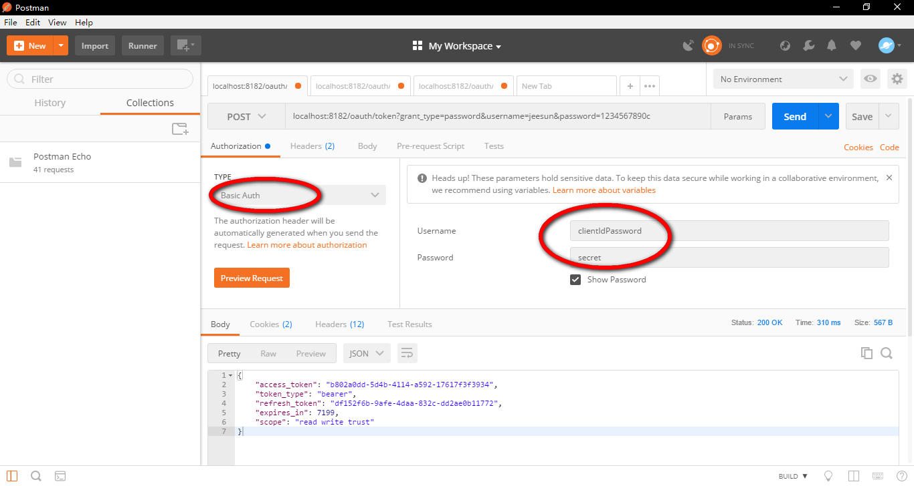
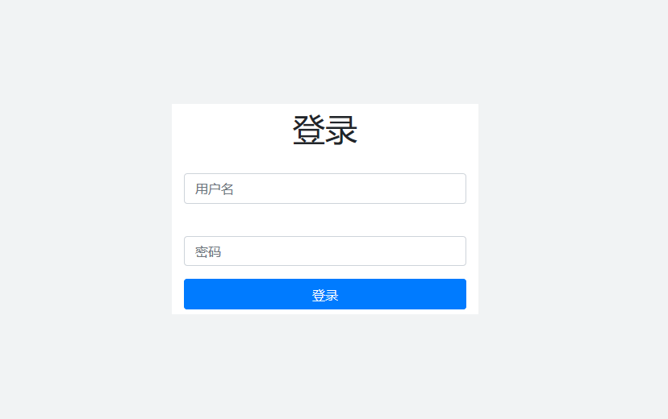
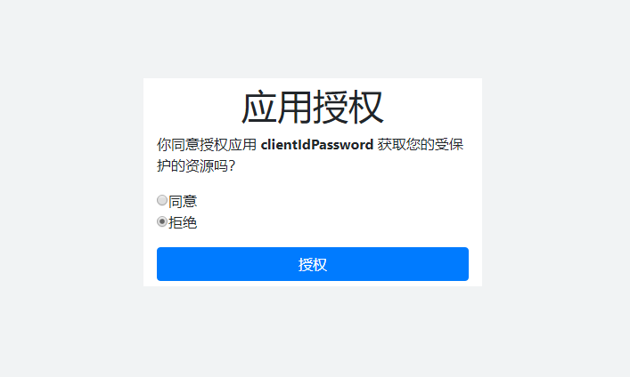

<p align="center">
<a href="http://www.oracle.com/technetwork/java/javase/overview/index.html"></a>
<a href="https://www.jetbrains.com/idea/"></a>
<a href="http://projects.spring.io/spring-boot/"></a>


</p>

# oauthserver
## 简介
oauthserver是一个基于Spring Boot Oauth2的完整的独立的Oauth2 Server微服务。仅仅需要创建相关数据表，修改数据库的连接信息，你就可以得到一个Oauth2 Server微服务。

~~Oauth2 Client通常是要被保护的资源，例如app接口。配套的Oauth2 Client示例可以在这里找到[https://github.com/jeesun/qbankserver](https://github.com/jeesun/qbankserver)。~~

支持的关系型数据库：
- PostgreSQL
- MySQL
- Oracle

已实现的功能：
1. token保存到关系型数据库；
2. 获取token时，username允许传用户名、手机号或者邮箱；
3. 自定义登录页面和授权页面，token获取支持密码模式和授权码模式；
4. 集成druid，并开启druid监控，访问[http://localhost:8182/druid](http://localhost:8182/druid)，用户名simon，密码19961120；
4. 集成Mybatis，以及插件：通用Mapper，PageHelper；
5. 集成swagger2，并配置非全局、无需重复输入的header参数（token），访问[http://localhost:8182/swagger-ui.html](http://localhost:8182/swagger-ui.html)，全局Authorize的值为"Bearer "+"access_token"，注意"Bearer"和"access_token"之间有一个空格；
6. 集成Redis缓存，默认使用Ehcache缓存，若要切换成Redis缓存，请查看`application.yml`缓存配置注释；
7. 集成阿里大鱼（需要安装阿里大鱼jar，安装方法：运行src/main/resources/jars/install.bat）；
8. 代码生成器，运行`com/simon/common/code/CodeGenerator.java`的main方法进行代码生成，代码生成器的配置在`code-gen.properties`。可生成Model、Mapper、Repository、Service、ServiceImpl、Controller。


请下载与Spring Boot对应版本的oauthserver：
<table border="0">
  <tr>
    <th>Spring Boot version</th>
    <th>oauthserver version</th>
  </tr>
  <tr>
    <td>1.x.x</td>
    <td>1.x.x</td>
  </tr>
  <tr>
    <td>2.x.x</td>
    <td>2.x.x</td>
   </tr> 
</table>

## 升级指南
1. 使用v2.x版本，需要修改数据表oauth_client_details的clicent_secret列的值，从明文secret改为经过Scrypt加密的字符串$2a$11$uBcjOC6qWFpxkQJtPyMhPOweH.8gP3Ig1mt27mGDpBncR7gErOuF6；
2. oauthserver v1.2.0添加了阿里大鱼的发送验证码功能，需要阿里大鱼的jar，安装方法：运行src/main/resources/jars/install.bat。

## 更新日志
### v.1.2.4.beta2(2018-09-13)
- 默认使用MySQL数据库连接配置，更新MySQL连接配置以支持utf8mb4编码；
- 新增BaseController，解决接口的时间类型传输问题；
- 默认开启mybatis二级缓存；
- 新增字典表t_dict_type和t_dict_type_group，新增字典工具类DictUtil；
- 更新MySQL建表语句。

**更多历史更新日志查看[CHANGE_LOG.md](CHANGE_LOG.md)**

## 使用流程
### 1. 建表
- PostgreSQL  
请执行`src/main/resources/schema-pg.sql`，完成数据表的创建和测试数据的导入。
- MySQL  
请执行`src/main/resources/schema-mysql.sql`，完成数据表的创建和测试数据的导入。
- Oracle  
请执行`src/main/resources/schema-oracle.sql`，完成数据表的创建和测试数据的导入。
### 2. 修改数据库连接信息
- PostgreSQL  
连接信息在`application-pg.yml`里。修改完数据库连接信息后，还需要设置`application.yml`的`spring.profiles.active=pg`。
- MySQL  
连接信息在`application-mysql.yml`里。修改完数据库连接信息后，还需要设置`application.yml`的`spring.profiles.active=mysql`。  
- Oracle  
连接信息在`application-oracle.yml`里。修改完数据库连接信息后，还需要设置`application.yml`的`spring.profiles.active=oracle`。  
数据库连接信息的配置项username和password可以经过jasypt加密，也可以直接填明文。若要使用jasypt加密，加密密钥由`jasypt.encryptor.password`配置，你可以使用test目录下的UtilTests工具得到加密字符串。
### 3. 运行
现在，一切已准备就绪。运行项目，当程序成功启动时，即表明你已配置成功。
### 4. 测试
`com.simon.common.config.OAuthSecurityConfig.java`的`clients`配置如下：
``` java
@Override
public void configure(ClientDetailsServiceConfigurer clients) throws Exception {
    clients.inMemory()
            .withClient("clientIdPassword")
            .secret("$2a$11$uBcjOC6qWFpxkQJtPyMhPOweH.8gP3Ig1mt27mGDpBncR7gErOuF6") //明文secret
            .scopes("read,write,trust")
            .authorizedGrantTypes("authorization_code", "refresh_token", "password", "client_credentials")
            .authorities("ROLE_ADMIN", "ROLE_USER")
            .accessTokenValiditySeconds(7200)//access_token有效期为2小时
            .refreshTokenValiditySeconds(5184000)//refresh_token有效期为2个月60天
            .autoApprove(false);
    //clients.jdbc(dataSource);
}
```

**token相关的接口，都需要进行Basic Oauth认证。**  
如下图所示：  

> 1、根据用户名和密码获取access_token
>> POST [http://localhost:8182/oauth/token?grant_type=password&username=jeesun&password=1234567890c](http://localhost:8182/oauth/token?grant_type=password&username=jeesun&password=1234567890c)

**成功示例**  
status=200，返回的json数据：
``` json
{
    "access_token": "ca582cd1-be6c-4a5a-82ec-10af7a8e06eb",
    "token_type": "bearer",
    "refresh_token": "c24a6143-97c8-4642-88b9-d5c5b902b487",
    "expires_in": 3824,
    "scope": "read write trust"
}
```
**失败示例**  
1. 用户名错误  
status=400，返回的json数据：
``` json
{
    "code": 400,
    "message": "用户名不存在",
    "data": null
}
```
2. 密码错误  
status=400，返回的json数据：
``` json
{
    "code": 400,
    "message": "密码错误",
    "data": null
}
```
3. 账号被封enabled=false  
status=400，返回的json数据：
``` json
{
    "code": 400,
    "message": "您已被封号",
    "data": null
}
```

> 2、检查access_token
>> GET [http://localhost:8182/oauth/check_token?token=ca582cd1-be6c-4a5a-82ec-10af7a8e06eb](http://localhost:8182/oauth/check_token?token=ca582cd1-be6c-4a5a-82ec-10af7a8e06eb)

**成功示例**  
即使用户被封enabled=false，access_token未过期仍然可用。  
status=200，返回的json数据：
``` json
{
    "aud": [
        "oauth2-resource"
    ],
    "exp": 1524507296,
    "user_name": "jeesun",
    "authorities": [
        "ROLE_ADMIN",
        "ROLE_USER"
    ],
    "client_id": "clientIdPassword",
    "scope": [
        "read",
        "write",
        "trust"
    ]
}
```
**失败示例**  
access_token已过期  
status=400，返回的json数据：
``` json
{
    "code": 400,
    "message": "Token无法识别",
    "data": null
}
```

> 3、根据refresh_token获取新的access_token
>> POST [http://localhost:8182/oauth/token?grant_type=refresh_token&refresh_token=c24a6143-97c8-4642-88b9-d5c5b902b487](http://localhost:8182/oauth/token?grant_type=refresh_token&refresh_token=c24a6143-97c8-4642-88b9-d5c5b902b487)

**成功示例**  
status=200，返回的json数据：
``` json
{
    "access_token": "690ecd7d-f2b7-4faa-ac45-5b7a319478e8",
    "token_type": "bearer",
    "refresh_token": "c24a6143-97c8-4642-88b9-d5c5b902b487",
    "expires_in": 7199,
    "scope": "read write trust"
}
```

**失败示例**  
用户被封enabled=false  
status=401，返回的json数据：
``` json
{
    "code": 401,
    "message": "用户已失效",
    "data": null
}
```

> 4、根据授权码获取token
>>POST [http://localhost:8182/oauth/authorize?response_type=code&client_id=clientIdPassword&scope=read&redirect_uri=http://www.baidu.com](http://localhost:8182/oauth/authorize?response_type=code&client_id=clientIdPassword&scope=read&redirect_uri=http://www.baidu.com)

  
同意授权，跳转到`https://www.baidu.com/?code=jgA1h3`，`jgA1h3`就是授权码。  
使用授权码获取token:   
>>POST [http://localhost:8182/oauth/token?grant_type=authorization_code&code=jgA1h3&redirect_uri=http://www.baidu.com](http://localhost:8182/oauth/token?grant_type=authorization_code&code=jgA1h3&redirect_uri=http://www.baidu.com)  

**成功示例**  
status=200，返回的json数据：
``` json
{
    "access_token": "ca582cd1-be6c-4a5a-82ec-10af7a8e06eb",
    "token_type": "bearer",
    "refresh_token": "c24a6143-97c8-4642-88b9-d5c5b902b487",
    "expires_in": 3824,
    "scope": "read write trust"
}
```
### 5. 关于国际化
接口参数添加locale，值为语言区域，例如zh_CN，zh_CH，en_US。

## app实践指南
app获取到token信息后，需要保存token信息和请求时间。在传access_token之前，需要检查access_token是否过期。为了减少后台压力，检查access_token是否过期应该是在app本地完成。通过token的key`expires_in`（剩余有效期）的值，以及本地记录的请求时间，和当前时间做对比，可以很方便地判断出access_token是否过期。如果过期了，需要通过refresh_token获取新的access_token。因为access_token的有效期只有2个小时，这个验证是必须的。    
refresh_token同理。
